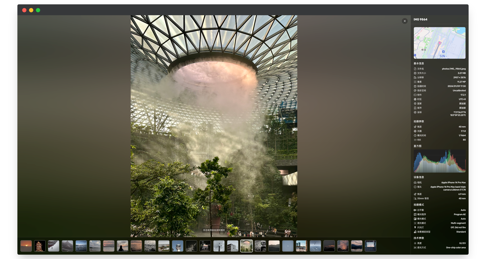
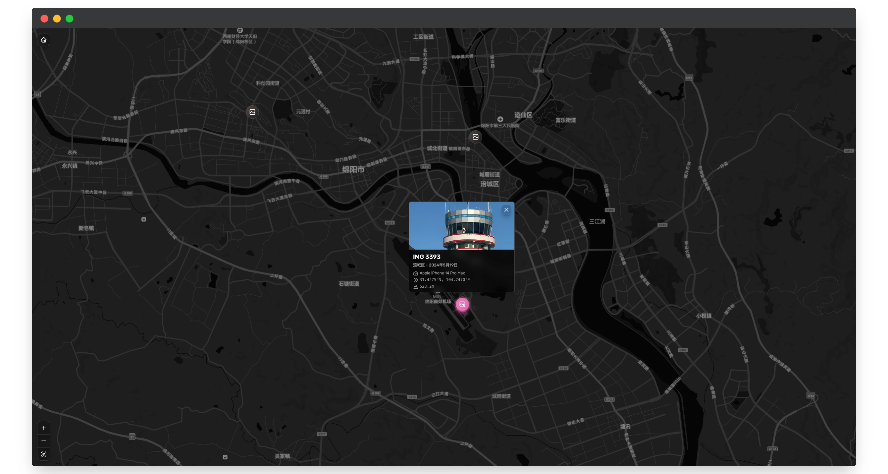

# ChronoFrame

<p align="center">
  
  <br/>
  
  
  
  
</p>

**Languages:** English | [中文](README_zh.md)

A smooth photo display and management application, supporting multiple image formats and large-size image rendering.

[Live Demo: TimoYin's Mems](https://lens.bh8.ga)

## ✨ Features

### 🖼️ Powerful Photo Management

- **Manage photos online** - Easily manage and browse photos via the web interface
- **Explore map** - Browse photo locations on a map
- **Smart EXIF parsing** - Automatically extracts metadata such as capture time, geolocation, and camera parameters
- **Reverse geocoding** - Automatically identifies photo shooting locations
- **Multi-format support** - Supports mainstream formats including JPEG, PNG, HEIC/HEIF
- **Smart thumbnails** - Efficient thumbnail generation using ThumbHash

### 🔧 Modern Tech Stack

- **Nuxt 4** - Built on the latest Nuxt framework with SSR/SSG support
- **TypeScript** - Full type safety
- **TailwindCSS** - Modern CSS framework
- **Drizzle ORM** - Type-safe database ORM

### ☁️ Flexible Storage Solutions

- **Multiple storage backends** - Supports S3-compatible storage, local filesystem
- **CDN acceleration** - Configurable CDN URL for faster photo delivery

## 🐳 Deployment

We recommend deploying with the prebuilt Docker image. [View the image on ghcr](https://github.com/HoshinoSuzumi/chronoframe/pkgs/container/chronoframe)

Create a `.env` file and configure environment variables.

Below is a **minimal configuration** example. For complete configuration options, see [.env.example](./.env.example):

```bash
# Admin email (required)
CFRAME_ADMIN_EMAIL=
# Admin username (optional, default Chronoframe)
CFRAME_ADMIN_NAME=
# Admin password (optional, default CF1234@!)
CFRAME_ADMIN_PASSWORD=

# Site metadata (all optional)
NUXT_PUBLIC_APP_TITLE=
NUXT_PUBLIC_APP_SLOGAN=
NUXT_PUBLIC_APP_AUTHOR=
NUXT_PUBLIC_APP_AVATAR_URL=

# Mapbox public token (required for map UI)
NUXT_PUBLIC_MAPBOX_ACCESS_TOKEN=
# Mapbox unrestricted token (optional, reverse geocoding)
NUXT_MAPBOX_ACCESS_TOKEN=

# Storage provider (local or s3)
NUXT_STORAGE_PROVIDER=local
NUXT_PROVIDER_LOCAL_PATH=/app/data/storage

# Session password (32‑char random string, required)
NUXT_SESSION_PASSWORD=
```

### Pull Image

Use the published image on GitHub Container Registry and Docker Hub. Choose the source that works best for your network:

#### [GitHub Container Registry (GHCR)](https://github.com/HoshinoSuzumi/chronoframe/pkgs/container/chronoframe)

```bash
docker pull ghcr.io/hoshinosuzumi/chronoframe:latest
```

#### [Docker Hub](https://hub.docker.com/r/hoshinosuzumi/chronoframe)

```bash
docker pull hoshinosuzumi/chronoframe:latest
```

### Docker

Run with customized environment variables:

```bash
docker run -d --name chronoframe -p 3000:3000 -v $(pwd)/data:/app/data --env-file .env ghcr.io/hoshinosuzumi/chronoframe:latest
```

### Docker Compose

Create docker-compose.yml:

```yaml
services:
  chronoframe:
    image: ghcr.io/hoshinosuzumi/chronoframe:latest
    container_name: chronoframe
    restart: unless-stopped
    ports:
      - '3000:3000'
    volumes:
      - ./data:/app/data
    env_file:
      - .env
```

Start:

```bash
docker-compose up -d
```

## 📖 User Guide

> If `CFRAME_ADMIN_EMAIL` and `CFRAME_ADMIN_PASSWORD` are not set, the default admin account is:
>
> - Email: `admin@chronoframe.com`
> - Password: `CF1234@!`

### Logging into the Dashboard

1. Click avatar to sign in with GitHub OAuth or use email/password login

### Uploading Photos

1. Go to the dashboard at /dashboard
2. On the Photos page, select and upload images (supports batch & drag-and-drop)
3. System will automatically parse EXIF data, generate thumbnails, and perform reverse geocoding

## 📸 Screenshots






## 🛠️ Development

### Requirements

- Node.js 18+
- pnpm 9.0+

### Install dependencies

```bash
# With pnpm (recommended)
pnpm install

# Or with other package managers
npm install
yarn install
```

### Configure environment variables

```bash
cp .env.example .env
```

### Initialize database

```bash
# 2. Generate migration files (optional)
pnpm db:generate

# 3. Run database migrations
pnpm db:migrate
```

### Start development server

```bash
pnpm dev
```

App will start at http://localhost:3000.

### Project Structure

```
chronoframe/
├── app/                    # Nuxt app
│   ├── components/         # Components
│   ├── pages/              # Page routes
│   ├── composables/        # Composables
│   └── stores/             # Pinia stores
├── packages/
│   └── webgl-image/        # WebGL image viewer
├── server/
│   ├── api/                # API routes
│   ├── database/           # DB schema & migrations
│   └── services/           # Business logic services
└── shared/                 # Shared types & utils
```

### Build commands

```bash
# Development (with dependencies build)
pnpm dev

# Build only dependencies
pnpm build:deps

# Production build
pnpm build

# Database operations
pnpm db:generate    # Generate migration files
pnpm db:migrate     # Run migrations

# Preview production build
pnpm preview
```

## 🤝 Contributing

Contributions are welcome! Please:

1. Fork the repo
2. Create a feature branch (git checkout -b feature/amazing-feature)
3. Commit changes (git commit -m 'Add some amazing feature')
4. Push to branch (git push origin feature/amazing-feature)
5. Open a Pull Request

### Coding Guidelines

- Use TypeScript for type safety
- Follow ESLint and Prettier conventions
- Update documentation accordingly

## 📄 License

This project is licensed under the MIT License.

## 👤 Author

**Timothy Yin**

- Email: master@uniiem.com
- GitHub: @HoshinoSuzumi
- Website: bh8.ga
- Gallery: lens.bh8.ga

## ❓ FAQ

<details>
  <summary>How is the admin user created?</summary>
  <p>
    On first startup, an admin user is created based on <code>CFRAME_ADMIN_EMAIL</code>, <code>CFRAME_ADMIN_NAME</code>, and <code>CFRAME_ADMIN_PASSWORD</code>. The email must match your GitHub account email used for login.
  </p>
</details>
<details>
  <summary>Which image formats are supported?</summary>
  <p>
    Supported formats: JPEG, PNG, HEIC/HEIF, MOV (for Live Photos).
  </p>
</details>
<details>
  <summary>Why can’t I use GitHub/Local storage?</summary>
  <p>
    Currently only S3-compatible storage is supported. GitHub and local storage support is planned.
  </p>
</details>
<details>
  <summary>Why is a map service required and how to configure it?</summary>
  <p>
    The map is used to browse photo locations and render mini-maps in photo details. Currently Mapbox is used. After registering, <a href="https://console.mapbox.com/account/access-tokens/">get an access token</a> and set it to the <code>MAPBOX_TOKEN</code> variable.
  </p>
</details>
<details>
  <summary>Why wasn’t my MOV file recognized as a Live Photo?</summary>
  <p>
    Ensure the image (.heic) and video (.mov) share the same filename (e.g., <code>IMG_1234.heic</code> and <code>IMG_1234.mov</code>). Upload order does not matter. If not recognized, you can trigger pairing manually from the dashboard.
  </p>
</details>
<details>
  <summary>How do I import existing photos from storage?</summary>
  <p>
    Direct import of existing photos is not yet supported. A directory scanning import feature is planned.
  </p>
</details>
<details>
  <summary>How is this different from Afilmory?</summary>
  <p>
    Afilmory generates a manifest from photos during local/CI processing and serves them statically. ChronoFrame is a dynamic photo management app, offering online upload, management, and browsing—better for frequently updated galleries.
    In other words, Afilmory = static; ChronoFrame = dynamic, online upload/manage.
  </p>
</details>

## 🙏 Acknowledgements

This project was inspired by [Afilmory](https://github.com/Afilmory/afilmory), another excellent personal gallery project.

Thanks to the following open-source projects and libraries:

- [Nuxt](https://nuxt.com/)
- [TailwindCSS](https://tailwindcss.com/)
- [Drizzle ORM](https://orm.drizzle.team/)

## ⭐️ Stargazers

[](https://starchart.cc/HoshinoSuzumi/chronoframe)
